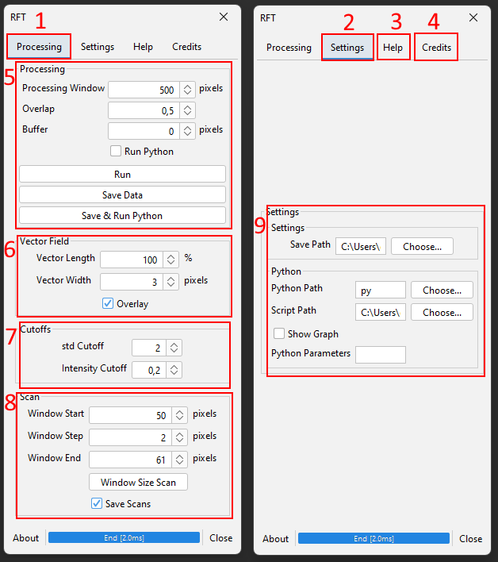

# Angle Analyzer

This package encompasses both the ImageJ plugin RFT, and the scripts used to further process the data.

## ImageJ
To automatically use the latest version, you can subscribe to the Hohlbein update site in ImageJ.
Otherwise, download the latest version from [here](https://github.com/HohlbeinLab/AnalyseDirectionality/releases) and place it in the plugins folder in your FIJI installation folder and restart the application.


<details>
<summary>Plugin Overview</summary>
<br>
To use the plugin, open an image and click Plugins > RFT > Analyze Angles
This opens the following window:



It contains the following tabs/settings:
1. Processing Tab: Contains settings related to analysis of current images
2. Settings Tab: Contains various paths and settings that need little changing
3. Help Tab: Contains detailed information, similar to this readme.
4. Credits Tab: Contains link to paper, GitHub, etc.
5. Processing Settings:
   1. Processing Window: window size used for analysis in px.
   2. Overlap: How much does each window overlap in x- and y-axis (fractional 0-1).
   3. Buffer: Distance from the top and left edge to start in px.
   4. Run Python toggle: When you press Run, execute the python part automatically
        - Requires the Python block to be filled in the Settings Tab
   5. Run: Run RFT and python if enabled
   6. Save Data: After running, save the data to a CSV
       - Requires the Save block to be filled in the Settings Tab
   7. Save the Data and Run the python backend. 
      - Requires the Save and Python block to be filled in the Settings Tab
6. Vector Field Settings:
   1. Vector Length: Relative length of the shown vectors
   2. Vector Width: Width of the shown vectors in px
   3. Overlay: Toggle showing the vector overlay
7. Cutoffs Settings: Cutoffs to show or hide a vector in the vector overlay
   1. Std Cutoff: How many standard deviations does the peak intensity of an angle need to be 
   2. Intensity Cutoff: Fraction of max intensity a region need to be
8. Scan Settings: Run processing in a range of window sizes. Saves, and requires Save path set.
   1. Window Start: Start in px
   2. Window Step: Steps in px
   3. Window End: End in px
   4. Window Size Scan: Perform the scan using the Buffer and overlap set in 5.
9. Settings
   1. Save Path: Path to save all intermediate CSV's to
      - Will create an folder called inputs here, and put CSV's into it. A pickle and results folder will also be made to put python results into.
      - Save format is: path\\file_name
   2. Python Path: Python instance to use. Generally can use 'py' or 'python' here.
      - Requires the following packages to be installed 'matplotlib, numpy, scipy, tqdm, openpyxl, astropy'
      - Install using `python.exe -m pip install matplotlib numpy scipy tqdm openpyxl astropy`
   3. Script path: Folder where the python script `gaussian_order.py` is located
   4. Show Graph: This will show all graphs in matplotlib window. Warning: they are not scaled to monitor, so will be big window.
   5. Python Parameters: Additional parameters to pass to `gaussian_order.py`. See Python section for these.

</details>

<details>
<summary>Macro</summary>
<br>
The plugin can be run from a macro using the following syntax:

```
run("Analyze Angles", "buffer=0 window=101 overlap=0.75 path='path\\to\\folder with spaces'");
```
or to run on a folder with python automatically
```
input = "path\\to\\folder";

setBatchMode(true);
list = getFileList(input);
for (i = 0; i < list.length; i++){
		open(input + list[i]);
		if (nImages>=1) {
	        run("Analyze Angles", "buffer=0 window=350 overlap=0.25 save_path='save\\path' python_path='py' script_path='path\\to\\script' run_python=True");
			close();
		}
}
setBatchMode(false);
```


All arguments follow the format of `keyword=value` using the period as the separator. When a path contains spaces, use single quote ticks to ensure the proper path is captured.

Note that when using macro mode, the program will always save, and thus `save_path` is required.

The arguments and their defaults are as follows:
 - buffer: 0
 - window: 50
 - cutoff: 2.0
 - overlap: 0.75
 - intensity_cutoff: 0.2
 - start: 50
 - end: 300
 - step: 50
 - scanning_range: False
 - vector_overlay: off
 - vector_length: 1
 - vector_width: 3
 - save_path: null
 - python_path: null
 - python_arguments: null
   - Format: `python_arguments='-single_threaded -filter_edges 1'`
   - See python section for details
 - show_graphs: False
 - run_python: False

</details>

## Python

### Structure

The python script takes in data formatted in the following way:
 - The header row must be:
      - `x, y, width, height, Max Index, Mask Median, Angle, Relevance, Profile Data`
- Then follow a number of rows such that each x and y combination is mentioned (`n_rows = unique(x)* unique(y)`)

   - x and y: coordinates of the top-left corner of this window in px
   - width and height: width and height of this window in px
   - Max Index: index of the maximum value in Profile Data
   - Mask Median: Median intensity in this window
   - Angle: angle associated with Max Index
   - Relevance: standard deviations of the peak amplitude above the mean
   - Profile Data: the intensity of each angle for this window
      - ImageJ plugin produces 200 values spread over a range of 180°.
      - This can be more of fewer values, but assumption is that they cover a range of 180°.
   - Example Row:
      - `0, 0, 151, 151, 144, 199, 129.6, 2.54, 4.04, 4.06, etc.`


The python section takes in a csv file created by the ImageJ plugin, but will work on any data formatted the correct way.

The python script can also be imported and called directly using either an argument string or setting each argument individually. The named arguments take precedent over arguments set via a string.

Filenames are always given without .csv

Examples:
- `gaussian_order.run(argument_string="-force_recalculation -c path\\to\\input -absolute -f file1,file2)`
- `gaussian_order.run(force_recalculation=True, core_path="path\\to\\input", absolute=True, filenames=["file1", "file2"])`
<details>
<summary>Arguments</summary>

 - match_angle: How far apart angles must be to be considered separate.
   - Angles closer than this will be clustered together
 - max_neighbourhood: Maximum region to calculate the WOP for.
   - Will continue until either this value is reached or the maximum size the image allows
 - filter_edges: How many windows to leave out on each edge
 - prominence: Percentage of max value above mimum that a peak must have (0-1)
 - min_peak_width: minimum width a peak must have in degrees
 - min_distance: minimum distance between peaks in degrees
 - singlethreaded: Run software in singlethreaded mode. 
   - Some users have reported issue using multiprocessing modes, so this disables that. Will be slower for large data sets.
 - image_format: Image format that matplotlib will save graphs in, e.g. png, svg
 - testing: Will enable testing mode and display detailed fit information for a single window.
   - Enter an integer, e.g. 1 or 2, to display that window and stop analysis then
 - seed: A custom seed to set rng. By default it is initialised with the same seed
 - show_graph: Shows the graphs generated. Will always save them.
 - all_angles: calculate the WOP on individual angles alongside the collective of angles. Together with the match_angle can allow one to analyse the distribution within clusters of angles and filter out unwanted angles.
  - no_recalculation: Store the data in a pickle file and reload if analysis is done again. Useful when analysing the same file multiple times or changing the pipeline after fitting.
      - The unique identifier is the filename, which includes window size, but not overlap.
- core_path: The folder to use as input. 
   - If absolute mode is turned on, will look at this filepath, otherwise, it will look in the script folder and append `\\input\\<core_path>`
- filenames: A comma-separated list of all the filenames to analyse. can also be set to `all` to recursively analyse each folder in `core_path`


</details>

# Citation
If you use this software for your paper, please cite [Rotated Fourier transform (RFT) enables the quantification of anisotropic structure in high-moisture plant-protein extrudates](). doi.

